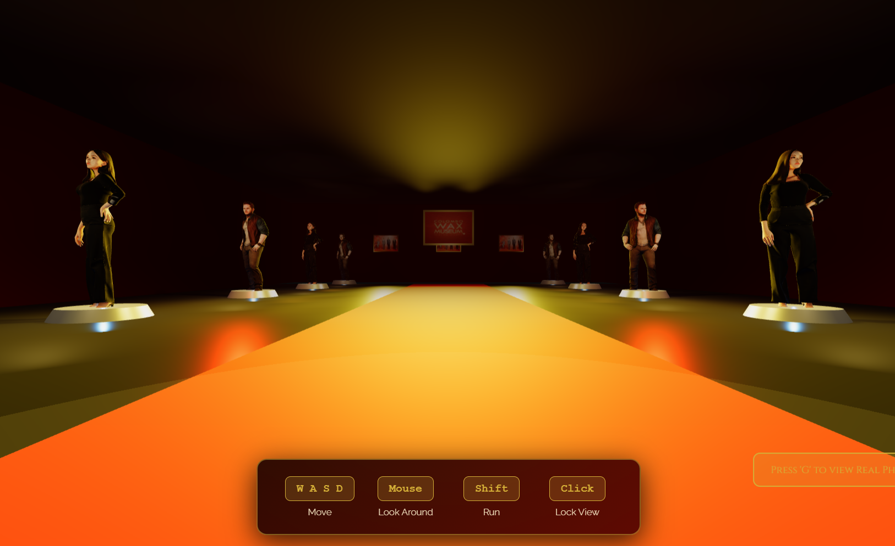

# 🎭 Colombo Wax Museum - Virtual 3D Experience

> **Step into history and meet legends in a stunning 3D virtual museum!**

[](https://senethlakshan.github.io/Colombo-Wax-Museum/)
[](https://senethlakshan.github.io/Colombo-Wax-Museum/)
[](https://threejs.org/)

---

## 🌟 Experience the Magic


_Walk through a beautifully lit virtual museum featuring realistic 3D wax figures on glowing pedestals with dramatic spotlights and a vibrant red carpet pathway_

---

## ✨ What Makes This Special?

This isn't just a website—it's an **immersive 3D experience** where you can:

- 🚶 **Walk freely** through a virtual museum using WASD controls
- 🎭 **Meet 8 legendary figures** brought to life with realistic 3D models
- 💡 **Enjoy cinematic lighting** with 56+ dramatic spotlights creating museum-quality ambiance
- 🖼️ **View real photos** from the actual Colombo Wax Museum
- 🎮 **Interact** with exhibits and explore at your own pace
- 🚪 **Grand entrance** with animated doors that open to welcome you

---

## 🎮 Controls

| Key       | Action                             |
| --------- | ---------------------------------- |
| **W**     | Move Forward                       |
| **A**     | Move Left                          |
| **S**     | Move Backward                      |
| **D**     | Move Right                         |
| **Mouse** | Look Around                        |
| **G**     | Open Photo Gallery                 |
| **Click** | Interact with Figures (when close) |

---

## 🎨 Features

### 🏛️ Authentic Museum Atmosphere

- **Red & Gold Theme** - Luxurious color scheme matching the real museum
- **Red Carpet Pathway** - Guide visitors through the exhibits
- **Museum Logo Display** - Prominently featured on the back wall
- **Decorative Photo Frames** - Real museum photos displayed in gold frames

### 💡 Professional Lighting System

Each wax figure has **7 dedicated lights**:

- 🌟 Main golden spotlight from above
- 🔥 Warm orange front accent light
- ✨ Amber side spotlights (left & right)
- 💫 Golden back rim light for edge highlights
- 🔵 Blue platform glow
- 🌅 Soft warm fill light

**Total: 56+ spotlights** creating dramatic museum-quality illumination!

### 🎭 Realistic 3D Wax Figures

- **Real 3D Models** - Not simple shapes! Using actual GLB character models
- **8 Legendary Figures** - Alternating male and female characters
- **Full Body Display** - Complete figures from head to feet
- **Dynamic Shadows** - Realistic shadow casting and receiving
- **Proper Scaling** - Life-sized figures on white marble pedestals

### 🎬 Animated Elements

- **Entrance Doors** - Smooth sliding animation with 3-stage reveal
- **Welcome Screen** - Elegant fade-in/fade-out transitions
- **Interactive Popups** - Information displays when approaching figures
- **Photo Gallery** - Slideshow of real museum photos

---

## 🛠️ Built With

| Technology                                                                         | Purpose                             |
| ---------------------------------------------------------------------------------- | ----------------------------------- |
|         | 3D rendering and WebGL graphics     |
|  | Interactive controls and animations |
|               | Structure and 3D canvas             |
|                | Styling and UI animations           |
|              | Loading GLB character models        |

---

## 📁 Project Structure

```
Colombo-Wax-Museum/
├── 📄 index.html                    # Main museum file (42 KB)
├── 📂 Assest/
│   ├── 📂 3d/
│   │   ├── 🧍 men.glb              # Male character model (14.6 MB)
│   │   ├── 🧍‍♀️ girls.glb            # Female character model (14.1 MB)
│   │   └── 📸 1222.png             # Museum screenshot
│   ├── 🖼️ preview.webp             # Museum logo
│   ├── 🖼️ preview (1).webp         # Photo frame image
│   ├── 📷 images (1).jpg           # Museum photo
│   └── 🗺️ s.png                    # Floor plan
└── 📂 .github/workflows/
    └── ⚙️ static.yml               # GitHub Pages deployment
```

---

## 🚀 Quick Start

### Visit Online (Easiest!)

Just click here: **[Visit Colombo Wax Museum](https://senethlakshan.github.io/Colombo-Wax-Museum/)** 🎭

### Run Locally

1. **Clone the repository:**

   ```bash
   git clone https://github.com/Senethlakshan/Colombo-Wax-Museum.git
   cd Colombo-Wax-Museum
   ```

2. **Open in browser:**
   - Simply open `index.html` in your browser
   - Or use a local server:

     ```bash
     # Python 3
     python -m http.server 8000

     # Node.js
     npx serve
     ```

3. **Visit:**
   - Open `http://localhost:8000` in your browser

---

## 🎯 How It Works

### 1. **Welcome Experience**

- Visitors are greeted with the museum logo and "ENTER MUSEUM" button
- Click to trigger the dramatic door-opening animation

### 2. **3D Environment**

- Built with Three.js for smooth WebGL rendering
- Camera positioned at human eye level (1.7 units)
- Fog effects for atmospheric depth

### 3. **Character Models**

- GLTFLoader loads realistic 3D GLB models
- Models alternate between `men.glb` and `girls.glb`
- Scaled to 3.0x for life-size appearance
- Positioned at 3.0 units height for full-body visibility

### 4. **Lighting Magic**

- Each figure has 7 dedicated lights
- Warm color palette (gold, orange, amber)
- Shadows enabled for realism
- Blue platform glow for the iconic museum look

### 5. **Interactive Features**

- WASD movement with collision detection
- Mouse look controls
- Proximity-based information popups
- Photo gallery overlay (press 'G')

---

## 🎨 Design Highlights

### Color Palette

- **Primary:** Red (`#8B0000`) & Gold (`#d4af37`)
- **Accents:** Blue (`#0066ff`) for platform glow
- **Lighting:** Warm orange (`#ff8c00`), Amber (`#ffaa33`)
- **Background:** Dark (`#0a0a0a`) for contrast

### Typography

- **Headings:** Cinzel (elegant serif)
- **Body:** Lato (clean sans-serif)

### Visual Effects

- Drop shadows with golden glow
- Smooth animations (1-2 second transitions)
- Glassmorphism for UI elements
- Gradient backgrounds

---

## 📸 Gallery

### Museum Interior


_Stunning view down the red carpet with wax figures on glowing blue pedestals, illuminated by warm golden spotlights_

### Features Showcase

- ✨ Realistic 3D character models
- 💡 Professional 7-light system per figure
- 🎭 Museum logo on back wall
- 🖼️ Decorative photo frames
- 🚪 Animated entrance doors
- 📸 Interactive photo gallery

---

## 🌟 Fun Facts

- **56+ Spotlights** illuminate the museum
- **28.7 MB** of 3D models for realistic figures
- **7 Lights** per wax figure for cinematic effect
- **3-Stage** door opening animation
- **8 Legendary Figures** on display
- **100% Browser-Based** - No downloads needed!

---

## 🎓 What I Learned

Building this project taught me:

- 🎮 **3D Graphics** - Working with Three.js and WebGL
- 💡 **Lighting Design** - Creating dramatic museum-quality lighting
- 📦 **3D Model Loading** - Using GLTFLoader for GLB files
- 🎨 **UI/UX Design** - Creating immersive experiences
- ⚡ **Performance** - Optimizing 3D rendering for browsers
- 🚀 **Deployment** - GitHub Pages with GitHub Actions

---

## 🔮 Future Enhancements

Ideas for the next version:

- [ ] Add more historical figures
- [ ] Audio guide narration
- [ ] VR support for immersive experience
- [ ] Mobile touch controls
- [ ] Multiplayer mode (visit with friends!)
- [ ] Custom figure information cards
- [ ] Background music and ambient sounds
- [ ] Day/night lighting modes

---

## 🤝 Contributing

Want to improve the museum? Contributions are welcome!

1. Fork the repository
2. Create your feature branch (`git checkout -b feature/AmazingFeature`)
3. Commit your changes (`git commit -m 'Add some AmazingFeature'`)
4. Push to the branch (`git push origin feature/AmazingFeature`)
5. Open a Pull Request

---

## 📜 License

This project is open source and available for educational purposes.

---

## 👨‍💻 Author

**Seneth Lakshan**

- GitHub: [@Senethlakshan](https://github.com/Senethlakshan)
- Project: [Colombo Wax Museum](https://github.com/Senethlakshan/Colombo-Wax-Museum)

---

## 🙏 Acknowledgments

- **Three.js** - Amazing 3D library
- **Colombo Wax Museum** - Inspiration and assets
- **GitHub Pages** - Free hosting
- **GLTFLoader** - 3D model loading
- **WebGL** - Browser 3D graphics

---

## 📞 Support

Having issues? Found a bug? Have suggestions?

- 🐛 [Report a Bug](https://github.com/Senethlakshan/Colombo-Wax-Museum/issues)
- 💡 [Request a Feature](https://github.com/Senethlakshan/Colombo-Wax-Museum/issues)
- ⭐ [Star this repo](https://github.com/Senethlakshan/Colombo-Wax-Museum) if you like it!

---

<div align="center">

## 🎭 Ready to Visit?

### **[ENTER THE MUSEUM](https://senethlakshan.github.io/Colombo-Wax-Museum/)** 🚪✨

_Experience history like never before!_

---

Made with ❤️ and Three.js

**[⬆ Back to Top](#-colombo-wax-museum---virtual-3d-experience)**

</div>
